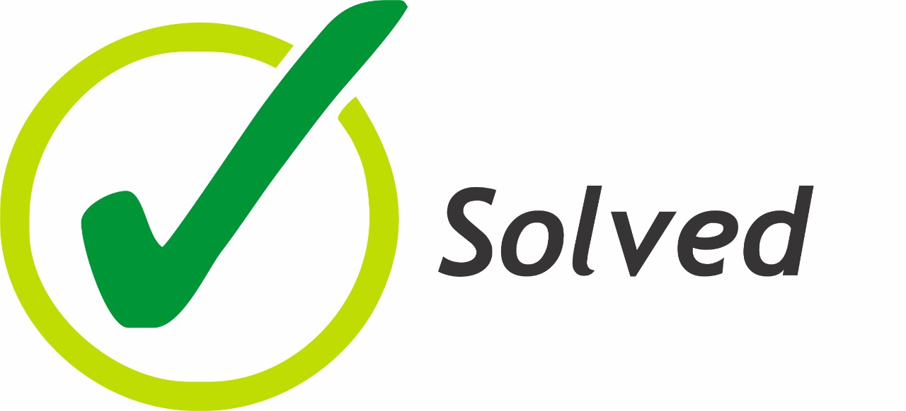

    

        

            
        

    

    <h1 class="title toc-ignore">Aquaculture</h1>
    <h4 class="author"><em>Solved - Solutions in Geoinformation</em></h4>

# About
This repository provides the steps to classify the Aquaculture class using Landsat Top of Atmosphere (TOA) mosaics.

The Aquaculture mapping is based on DeepLearning (DL) classifier U-Net.

For more information about the methodology, please see the [Coastal Zone Algorithm Theoretical Basis Document.](https://brasil.mapbiomas.org/wp-content/uploads/sites/4/2024/08/Coastal-Zone-Appendix-ATBD-Collection-9.docx.pdf)

<!-- # Release History

* 1.0.0
    * Description -->

# How to use
## 1. Prepare environment.

1.1. The Aquaculture mapping is based on DeepLearning (DL) classifier: U-Net. Thus it uses the COLAB structure, rather than purelly GEE code editor. 

## 2. Mosaic and grid generation. 
Start processing the annual cloud free composities, Mosaic.js (cloud removed median mosaics from 1985 - 2023).

Example: users/solved/0 - Mosaic.js 
`// linkar aqui o script`

## 3. Create the water mask.

3.1. To help in the process of grabbing samples and reduce the complexity of identifying Aquaculture ponds, a water mask is generated:

users/solved/DL - Clusterization_PreDataset.js

3.2. Grabbing samples. DL classifiers demand exaustive selection of tranning samples. Guided the learning processess by manuaaly indicating areas of non-aquaculture and aquaculture:

users/solved/DL - TrainTest Geom.js

## 4. Classification

Once trained, run the U-Net classifier.

Example:

users/solved/Mapbiomas 5 Brazil - UNet - Aquicultura.ipynb

# References
### REFERENCE DATA

|CLASS | REFERENCES|
|:----:|:---------:|
|AQUACULTURE / SALT-CULTURE|MapBiomas Collection 8, Atlas Dos Remanescentes Florestais da Mata Atlântica (SOS Mata Atlântica, 2020), Barbier and Cox, 2003; Guimarães et al., 2010; Prates, Gonçalves and Rosa, 2010, Queiroz et al., 2013; Tenório et al., 2015; Thomas et al., 2017, Diniz et al., 2021, São José et al., 2022, plus visual inspection.

--- 

### REFERENCE LITERATURE
GUIMARÃES, A. S. et al. Impact of aquaculture on mangrove areas in the northern Pernambuco Coast (Brazil) using remote sensing and geographic information system. Aquaculture Research, v. 41, n. 6, p. 828–838, 13 maio 2010. 

QUEIROZ, L. et al. Shrimp aquaculture in the federal state of Ceará, 1970–2012: Trends after mangrove forest privatization in Brazil. [s.l: s.n.]. v. 73

TENÓRIO, G. S. et al. Mangrove shrimp farm mapping and productivity on the Brazilian Amazon coast: Environmental and economic reasons for coastal conservation. Ocean & Coastal Management, v. 104, p. 65–77, 2015. 

USGS. LANDSAT COLLECTION 1 LEVEL 1 PRODUCT DEFINITION. [s.l.] Earth Resources Observation and Science (EROS) Center, 2017. 

XU, H. Modification of normalised difference water index (NDWI) to enhance open water features in remotely sensed imagery. International Journal of Remote Sensing, v. 27, n. 14, p. 3025–3033, 20 jul. 2006. 
 